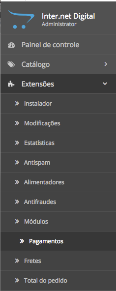
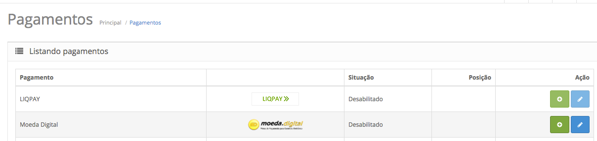
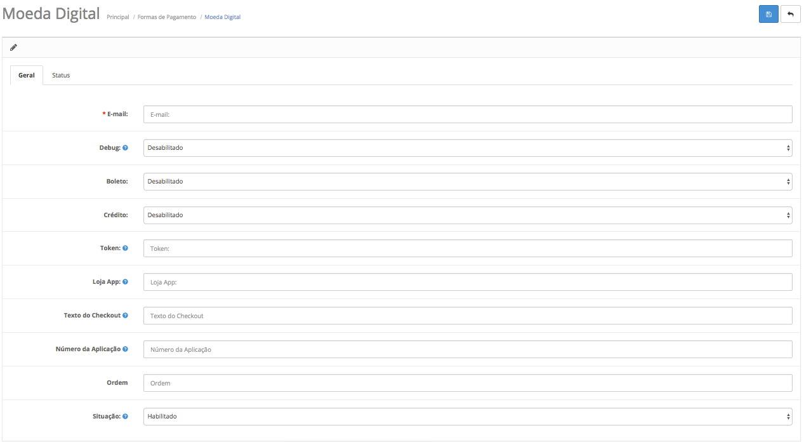
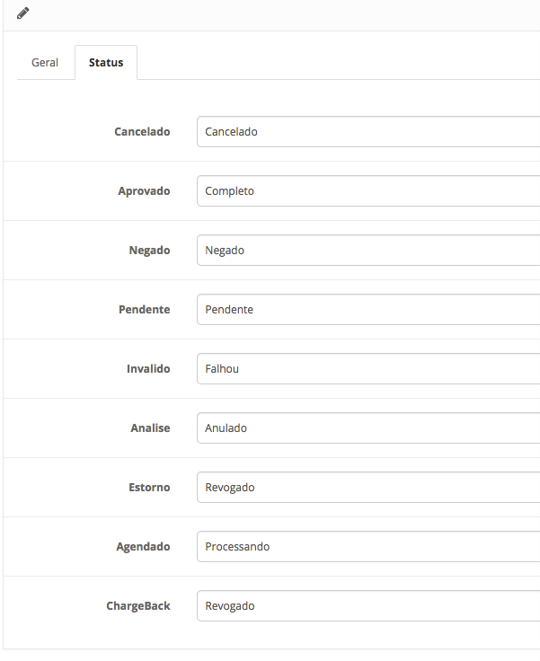
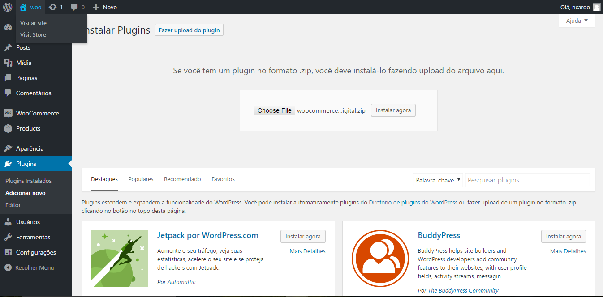
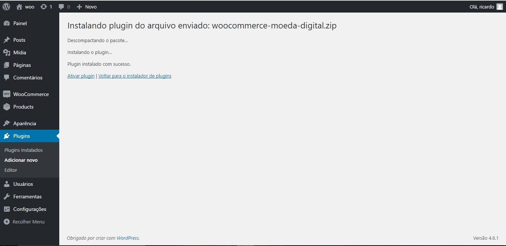
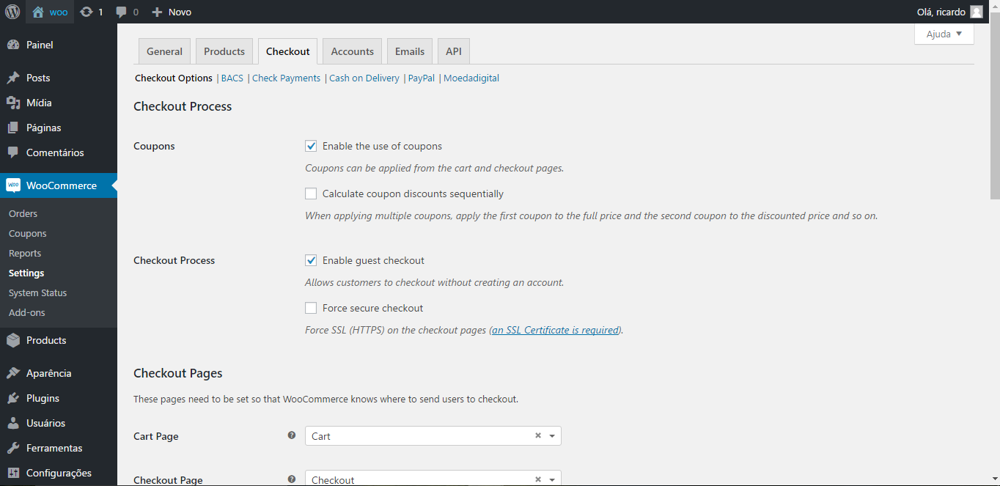
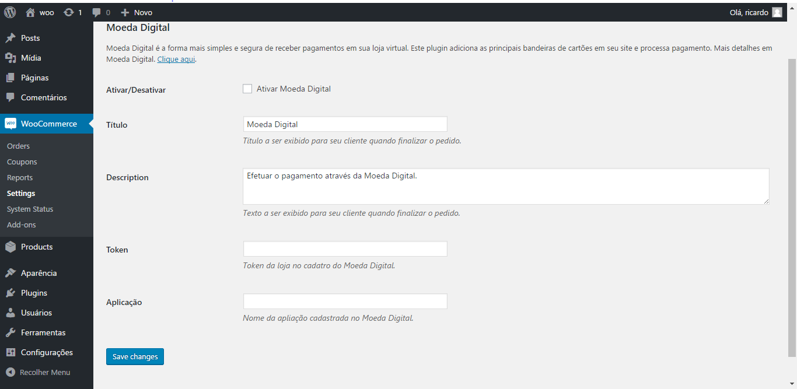

MODULOS e PLUGINS
==================

###Sobre

Utilize os Plugins e Módulos disponíveis para integrar com as principais plataformas de e-commerce.

>**Nota**: Não se esqueça de se cadastrar na Moeda Digital para poder configurar os plugins corretamente. 

OpenCart
--------

###Instalação

 1. Faça o Download do módulo:
	[Download](https://github.com/MoedaDigital/OpenCartPlugin/archive/master-download.zip)

 2. Descompacte o arquivo e copie o conteúdo de cada pasta (**Admin** e **Catalog**) para dentro das respectivas pastas no diretório da sua aplicação OpenCart.

 	>**Nota**: Geralmente encontra-se na raíz da instalação.

 3. Acesse o site de sua loja e navegue até ***Extensões → Pagamentos ***

	

 4. Encontre **MoedaDigital** na lista de pagamentos e clique em **instalar**.

	


###Configuração

 1. Acesse o site de sua loja e navegue até ***Extensões → Pagamentos ***

	

 2. Encontre MoedaDigital e clique em **Editar** (botão azul com ícone de um lápis).

 3. Na aba ***Geral*** preencha os campos com os dados necessários:
	
	- Email: Preencha com seu E-mail de login na Moeda Digital.
	- Token: O Token da sua loja na Moeda Digital. (Pode ser consultado no painel do Administrador no site da Moeda Digital).
	- Loja app: O nome da aplicação configurada dentro da Moeda Digital.
	- Texto do Checkout: serve para modificar o texto da opção a ser selecionada para pagar com o Moeda Digital durante a finalização do pedido.
	- Número da aplicação: é opcional, use caso queira enumerar suas aplicações na Moeda Digital.
	- Ordem: a posição em que a Moeda Digital aparecerá entre os meios de pagamento.
	- Situação: escolha **habilitado** para a Moeda Digital aparecer na tela de pagamento.

	

 4. Na aba **Status** preencha os campos da seguinte maneira:

 	- Cancelado: Cancelado
 	- Aprovado: Completo
 	- Negado: Negado
 	- Pendente: Pendente
 	- Invalido: Falhou
 	- Analise: Anulado
 	- Estorno: Revogado
 	- Agendado: Processando
 	- Chargeback: Revogado

	

 5. Clique no botão salvar, pronto, a Moeda Digital está configurada na sua aplciação!


WooCommerce
-----------

###Instalação

 1. Faça o Download do módulo:
	 [GitHub Download](https://github.com/MoedaDigital/WooCommercePlugin/archive/master.zip)
	 >**Nota:** Descompacte o arquivo e compacte apenas a pasta **src**

 2. No painel de admin do wordpress vá em ***Plugins → Adicionar Novo***

 3. Clique em **Fazer upload do plugin**, escolha o arquivo .zip baixado anteriormente e selecione **Instalar**.
 	
	

 4. Após a instalação, clique em **Ativar Plugin**.

	

###Configurando

 1. Dentro do painel de admin vá em ***WooCommerce → Settings (Configurações)***, e selecione a aba **Checkout (Finalizar Compra)** (Finalizar Compra)
	
	

 2. Em ***Checkout Options (Opções de pagamento)*** , clique em ***Moedadigital*** e preencha os campos:
	
	- Ativar/Desativar: Selecione este campo para que o WooCommerce apresente a Moeda Digital como meio de pagamento.
	- Titulo: Nome que será exibido ao cliente na seleção de meio de pagamentos ao finalizar a compra.
	- Description: Texto que será exibido ao cliente dentro da opção de pagar pela Moeda Digital.
	- Token: O Token da sua loja na Moeda Digital. (Pode ser consultado no painel do Administrador no site da Moeda Digital).
	- Aplicação: O nome da aplicação configurada dentro da Moeda Digital.

	
 
 3. Clique em salvar. Pronto! o seu site está configurado para utilizar a Moeda Digital.
 
 4. Dentro das configurações da aplicação no painel da Moeda Digital, configure a URL de retorno para 
	``` 
	***dominio****/index.php?wc-api=callbackmoeda&?* 
	```
	substituindo **dominio** pelo endereço de seu site. 

 5. Escolha tipo de retorno : **URL** 
 
 6. Faça alguns testes e Boas vendas!
