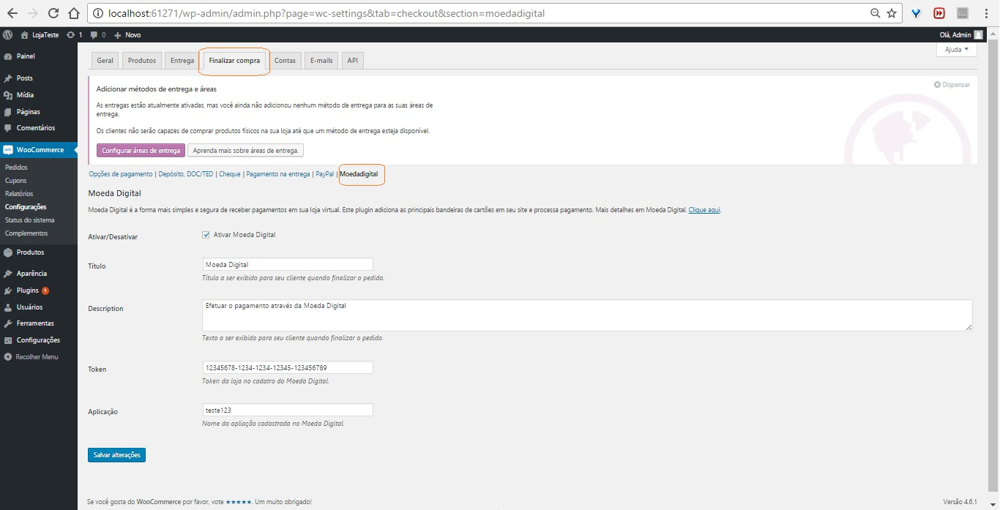

MODULOS e PLUGINS
==================

Utilize os Plugins e Módulos disponíveis para integrar com as principais plataformas de e-commerce. 

OpenCart
--------

###Instalação

 1. Faça o Download do módulo:
	[Nosso repositório](https://github.com/MoedaDigital/OpenCart/archive/master.zip)
	[Loja OpenCart](https://github.com/MoedaDigital/OpenCart/archive/master.zip)

 2. Entre no painel de controle do OpenCart e clique na área de ***Instalações e módulos → Instalador***

 3. Faça o Upload do módulo e clique em continuar.

 4. Após o upload vá até a área de pagamentos e clique em **instalar**.

###Configuração

WooCommerce
-----------

###Instalação

 1. Faça o Download do módulo:
	[Download](https://github.com/MoedaDigital/WooCommerce/archive/master.zip)

 2. Descompacte o arquivo .zip na pasta:
	
	***wordpress\wp-content\plugins\woocommerce-moeda-digital***

 3. Vá até o painel de administração do WooCommerce e configure o meio de pagamento.

 	Exemplo:
 	

###Comece a Testar

Magento
-------

####[Download](https://github.com/MoedaDigital/Magento/archive/master.zip)

SDK Android
-----------

SDK iOS
-------
